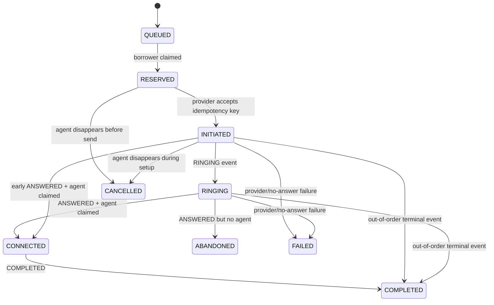

# State machines

## Agent lifecycle

```mermaid
stateDiagram-v2
    [*] --> OFFLINE
    OFFLINE --> AVAILABLE: sign in
    AVAILABLE --> RESERVED: progressive allocation (atomic)
    AVAILABLE --> CONNECTED: predictive answer allocation (atomic)
    RESERVED --> DIALING: provider accepts initiation
    RESERVED --> OFFLINE: agent disappears / call cancelled
    DIALING --> CONNECTED: ANSWERED
    DIALING --> AVAILABLE: FAILED / cancellation
    DIALING --> OFFLINE: agent disappears / call cancelled
    CONNECTED --> WRAP_UP: COMPLETED
    WRAP_UP --> AVAILABLE: wrap-up lease expires
    AVAILABLE --> PAUSED: agent pauses
    PAUSED --> AVAILABLE: resume
    AVAILABLE --> OFFLINE: sign out
    CONNECTED --> OFFLINE: agent disappears; call completion still reconciles
```

Agent transitions that claim capacity use `BEGIN IMMEDIATE`, select a candidate,
and update it with `WHERE state = old_state AND version = old_version`. The
transaction contains the borrower claim and call/outbox creation too, so no partial
reservation is visible.

## Call lifecycle

The implementation creates a call directly in `RESERVED`; `QUEUED` is retained as
a domain state for a future asynchronous campaign queue. Event ranks are monotonic.
`COMPLETED`, `FAILED`, `CANCELLED`, and `ABANDONED` are terminal and cannot reopen.
An event is first inserted under unique `(provider, event_id)`, in the same database
transaction as its state change. A crash therefore commits both or neither.

## Initiation job lifecycle

```mermaid
stateDiagram-v2
    [*] --> PENDING: allocation transaction
    PENDING --> IN_PROGRESS: worker lease
    IN_PROGRESS --> DONE: provider accepted + DB commit
    IN_PROGRESS --> PENDING: timeout + bounded backoff
    IN_PROGRESS --> IN_PROGRESS: lease expired; another worker claims
    IN_PROGRESS --> FAILED: third timeout
    PENDING --> CANCELLED: agent disappeared
```

The difficult window is provider acceptance followed by worker death. The database
still shows `IN_PROGRESS`; after the lease expires a replacement sends the same
`call_id` idempotency key. A compliant provider returns the original call rather
than creating another one.

